# 🔄 MCP Server - Complete Workflow Flowchart

## 🎯 **What is the MCP Server?**

The **MCP (Model Context Protocol) Server** is the **core workflow orchestrator** that acts as a bridge between:
- **Frontend UI** (user interface)
- **Gemini AI API** (AI optimization)
- **BigQuery** (database execution)
- **Validation Engine** (syntax, schema, and LLM cleanup)

It's essentially the **"brain"** that coordinates the entire SQL optimization process.

## 🔄 **Complete MCP Server Workflow Flowchart**

## 🔍 **Detailed MCP Server Responsibilities**

### **1. 🎯 Workflow Orchestration**
- **Coordinates** all optimization steps
- **Manages** the flow between different phases
- **Handles** state transitions and error conditions
- **Ensures** consistent processing for all request types

### **2. 🤖 AI Integration Management**
- **Initializes** Gemini API client
- **Manages** token limits and documentation loading
- **Handles** AI API failures gracefully
- **Implements** fallback strategies

### **3. 🔍 Multi-Stage Validation**
- **Orchestrates** the 6-step validation pipeline
- **Coordinates** between regex fixes and LLM cleanup
- **Manages** schema validation against BigQuery
- **Ensures** query quality at each step

### **4. ⚡ Execution Management**
- **Coordinates** BigQuery query execution
- **Collects** performance metrics
- **Handles** execution errors
- **Manages** result collection

### **5. 📊 Analysis & Comparison**
- **Performs** hash-based result validation
- **Calculates** performance improvements
- **Analyzes** result preservation
- **Generates** comprehensive metrics

### **6. 📤 Response Generation**
- **Builds** unified response objects
- **Structures** data for frontend consumption
- **Handles** error cases gracefully
- **Ensures** consistent response format

## 🏗️ **MCP Server Architecture Components**

```mermaid
graph TB
    subgraph "MCP Server Core"
        MAIN[🎯 Main Workflow Controller<br/>DirectSQLOptimizationHandler]
        AI_MGR[🤖 AI Integration Manager<br/>Gemini Client Management]
        VAL_MGR[🔍 Validation Manager<br/>Multi-Stage Pipeline]
        EXEC_MGR[⚡ Execution Manager<br/>BigQuery Operations]
        COMP_MGR[📊 Comparison Manager<br/>Result Analysis]
    end
    
    subgraph "External Dependencies"
        GEMINI[🤖 Gemini 2.5 Pro API]
        BQ[⚡ BigQuery Client]
        DOCS[📚 Markdown Documentation]
        ENV[🔑 Environment Variables]
    end
    
    subgraph "Internal Services"
        TOKEN_MGR[🔢 Token Management<br/>Documentation Trimming]
        ERROR_HANDLER[⚠️ Error Handler<br/>Fallback Strategies]
        RESPONSE_BUILDER[📤 Response Builder<br/>Data Structuring]
        LOGGER[📝 Logger<br/>Workflow Tracking]
    end
    
    %% Core Flow
    MAIN --> AI_MGR
    MAIN --> VAL_MGR
    MAIN --> EXEC_MGR
    MAIN --> COMP_MGR
    
    %% AI Integration
    AI_MGR --> GEMINI
    AI_MGR --> TOKEN_MGR
    AI_MGR --> DOCS
    
    %% Validation
    VAL_MGR --> AI_MGR
    VAL_MGR --> ERROR_HANDLER
    
    %% Execution
    EXEC_MGR --> BQ
    EXEC_MGR --> ERROR_HANDLER
    
    %% Comparison
    COMP_MGR --> RESPONSE_BUILDER
    
    %% Environment & Logging
    MAIN --> ENV
    MAIN --> LOGGER
    
    %% Response
    MAIN --> RESPONSE_BUILDER
    
    style MAIN fill:#e8f5e8,stroke:#1b5e20,stroke-width:3px
    style AI_MGR fill:#fff3e0,stroke:#e65100,stroke-width:2px
    style VAL_MGR fill:#fce4ec,stroke:#880e4f,stroke-width:2px
    style EXEC_MGR fill:#e0f2f1,stroke:#004d40,stroke-width:2px
    style COMP_MGR fill:#f3e5f5,stroke:#4a148c,stroke-width:2px
    style TOKEN_MGR fill:#e1f5fe,stroke:#01579b,stroke-width:2px
    style ERROR_HANDLER fill:#ffebee,stroke:#c62828,stroke-width:2px
    style RESPONSE_BUILDER fill:#e8f5e8,stroke:#1b5e20,stroke-width:2px
    style LOGGER fill:#f1f8e9,stroke:#33691e,stroke-width:2px
```

## 🎯 **Key MCP Server Features**

### **🔄 Unified Processing**
- **Single Entry Point**: All optimization requests go through the same workflow
- **Consistent Behavior**: Identical processing for single queries and test suites
- **Predictable Results**: Same validation and execution logic

### **🛡️ Robust Error Handling**
- **Graceful Degradation**: Continues processing even if some steps fail
- **Fallback Strategies**: Multiple approaches for handling failures
- **Comprehensive Logging**: Detailed tracking of all operations

### **⚡ Performance Optimization**
- **Token Management**: Intelligent documentation loading
- **Parallel Processing**: Where possible, operations run concurrently
- **Resource Management**: Efficient use of API calls and database connections

### **🔍 Quality Assurance**
- **Multi-Stage Validation**: Comprehensive query checking
- **Result Preservation**: Ensures optimized queries return identical results
- **Performance Monitoring**: Real-time metrics collection and analysis

The MCP Server is essentially the **"command center"** that makes the entire BigQuery optimization system work seamlessly! 🚀 