# 🏗️ BigQuery Query Optimizer - Visual Architecture

## 🚀 **UNIFIED WORKFLOW ARCHITECTURE**

The system now uses a **single, unified workflow** for both individual queries and test suites, ensuring consistent behavior and results.

### **System Overview**

```mermaid
graph TB
    %% User Interface Layer
    UI[🎨 Frontend UI<br/>React-like Components<br/>Responsive Design]
    
    %% API Gateway Layer
    API[🔌 FastAPI Gateway<br/>RESTful Endpoints<br/>Request Validation]
    
    %% Core Workflow Engine
    WORKFLOW[⚙️ Unified Workflow Engine<br/>DirectSQLOptimizationHandler]
    
    %% Gemini AI Integration
    GEMINI[🤖 Gemini 2.5 Pro API<br/>AI-Powered Optimization<br/>Context-Aware Processing]
    
    %% Documentation System
    DOCS[📚 Markdown Documentation<br/>optimization_docs_md/<br/>Token-Aware Loading]
    
    %% Validation & Execution Layer
    VALIDATION[🔍 Multi-Stage Validation<br/>Syntax + Schema + LLM Cleanup]
    EXECUTION[⚡ BigQuery Execution<br/>Performance Metrics<br/>Result Comparison]
    
    %% Data Flow
    UI -->|SQL Query + Project ID| API
    API -->|Request| WORKFLOW
    
    %% Core Workflow Steps
    WORKFLOW -->|Step 1: Raw SQL| GEMINI
    GEMINI -->|Step 2: AI Optimization| VALIDATION
    
    %% Validation Pipeline
    VALIDATION -->|Step 3: Regex Syntax Fix| VALIDATION
    VALIDATION -->|Step 4: LLM Cleanup| VALIDATION
    VALIDATION -->|Step 5: Schema Validation| VALIDATION
    VALIDATION -->|Step 6: LLM Final Cleanup| VALIDATION
    
    %% Execution & Comparison
    VALIDATION -->|Step 7: Query Execution| EXECUTION
    EXECUTION -->|Step 8: Result Comparison| EXECUTION
    EXECUTION -->|Step 9: Hash Validation| EXECUTION
    
    %% Documentation Integration
    DOCS -->|Context + Best Practices| GEMINI
    
    %% Response Flow
    EXECUTION -->|Unified Results| WORKFLOW
    WORKFLOW -->|Complete Response| API
    API -->|JSON Response| UI
    
    %% Styling
    classDef uiLayer fill:#e1f5fe,stroke:#01579b,stroke-width:2px
    classDef apiLayer fill:#f3e5f5,stroke:#4a148c,stroke-width:2px
    classDef workflowLayer fill:#e8f5e8,stroke:#1b5e20,stroke-width:2px
    classDef aiLayer fill:#fff3e0,stroke:#e65100,stroke-width:2px
    classDef validationLayer fill:#fce4ec,stroke:#880e4f,stroke-width:2px
    classDef executionLayer fill:#e0f2f1,stroke:#004d40,stroke-width:2px
    classDef docsLayer fill:#f1f8e9,stroke:#33691e,stroke-width:2px
    
    class UI uiLayer
    class API apiLayer
    class WORKFLOW workflowLayer
    class GEMINI aiLayer
    class VALIDATION validationLayer
    class EXECUTION executionLayer
    class DOCS docsLayer
```

### **Detailed Workflow Sequence**

### **Validation Pipeline Flow**

### **Component Architecture**

```mermaid
graph LR
    subgraph "Frontend Layer"
        UI[🎨 Enhanced UI<br/>Responsive Design<br/>Copy Functionality]
        TS[🧪 Test Suite Interface<br/>Integrated Results<br/>Comprehensive Display]
    end
    
    subgraph "API Gateway"
        API[🔌 FastAPI Router<br/>Request Validation<br/>Error Handling]
        VAL[✅ Pydantic Models<br/>Data Integrity<br/>Type Safety]
    end
    
    subgraph "Core Engine"
        WF[⚙️ DirectSQLOptimizationHandler<br/>Unified Workflow<br/>State Management]
        GEM[🤖 Gemini Integration<br/>AI Optimization<br/>Context Management]
    end
    
    subgraph "Validation Engine"
        SYN[🔧 Syntax Validation<br/>Regex Processing<br/>Fast Fixes]
        SCH[🏗️ Schema Validation<br/>BigQuery Metadata<br/>Reference Checking]
        LLM[🧠 LLM Cleanup<br/>Intelligent Refinement<br/>Query Optimization]
    end
    
    subgraph "Execution Engine"
        BQ[⚡ BigQuery Client<br/>Query Execution<br/>Performance Monitoring]
        COMP[📊 Result Comparison<br/>Hash Validation<br/>Metrics Collection]
    end
    
    subgraph "Documentation"
        MD[📚 Markdown Files<br/>Best Practices<br/>Token Management]
    end
    
    UI --> API
    TS --> API
    API --> WF
    WF --> GEM
    GEM --> SYN
    SYN --> SCH
    SCH --> LLM
    LLM --> BQ
    BQ --> COMP
    MD --> GEM
    
    style UI fill:#e1f5fe
    style TS fill:#e1f5fe
    style API fill:#f3e5f5
    style VAL fill:#f3e5f5
    style WF fill:#e8f5e8
    style GEM fill:#fff3e0
    style SYN fill:#fce4ec
    style SCH fill:#fce4ec
    style LLM fill:#fce4ec
    style BQ fill:#e0f2f1
    style COMP fill:#e0f2f1
    style MD fill:#f1f8e9
```

## 🎯 **Key Architectural Features**

### **🔄 Unified Workflow**
- **Single Path**: All optimization requests follow identical workflow
- **Consistent Behavior**: Same processing for single queries and test suites
- **Predictable Results**: Identical validation and execution logic

### **🔍 Multi-Stage Validation**
- **Sequential Processing**: Each step builds on previous validation
- **Fallback Mechanisms**: Multiple cleanup strategies for robustness
- **Quality Assurance**: Comprehensive query validation pipeline

### **🤖 AI-First Approach**
- **Intelligent Optimization**: Gemini-driven query improvement
- **Context Awareness**: Documentation-informed decisions
- **Continuous Learning**: Prompt refinement based on results

### **⚡ Performance Focus**
- **Real Metrics**: Actual execution time and cost measurements
- **Efficiency Analysis**: Comprehensive performance comparison
- **Resource Optimization**: BigQuery best practices implementation

This architecture ensures a robust, scalable, and user-friendly BigQuery optimization system with consistent behavior across all use cases! 🚀 