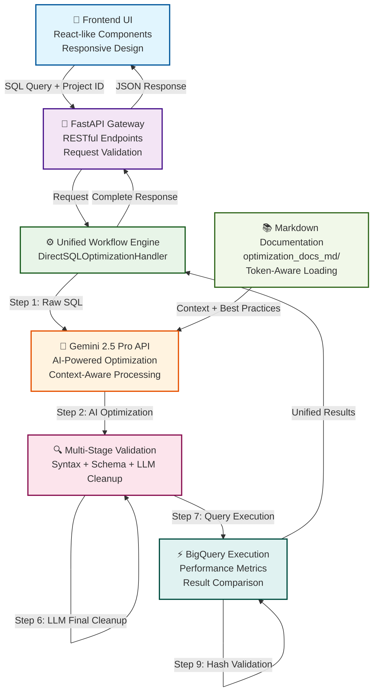
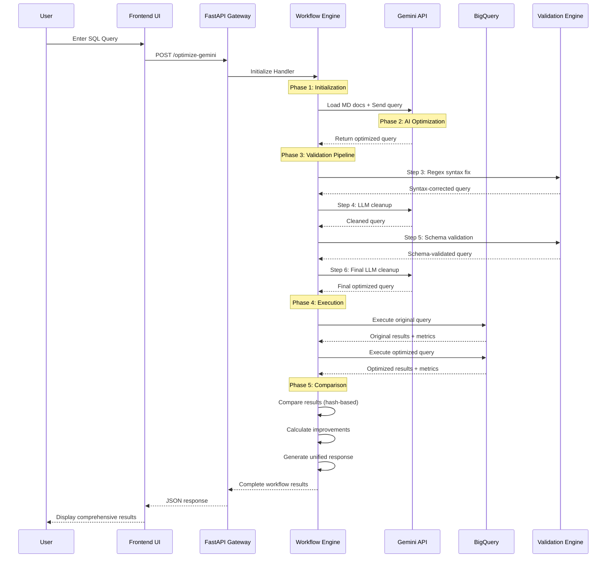

# 🏗️ BigQuery Query Optimizer - Architecture Diagram

## 🚀 **UNIFIED WORKFLOW ARCHITECTURE**

The system now uses a **single, unified workflow** for both individual queries and test suites, ensuring consistent behavior and results.



## 🔄 **DETAILED WORKFLOW STEPS**

### **Phase 1: Input & Initialization**
```
User Input → API Gateway → DirectSQLOptimizationHandler
├── SQL Query (raw, unvalidated)
├── Project ID (optional)
├── Validation flags
└── Performance measurement flags
```

### **Phase 2: AI-Powered Optimization**
```
Gemini API Integration
├── Load all MD documentation from optimization_docs_md/
├── Token-aware content selection (fallback strategies)
├── System prompt with optimization guidelines
├── User prompt with SQL query
└── AI-generated optimized query
```

### **Phase 3: Multi-Stage Validation & Cleanup**
```
Validation Pipeline (Sequential)
├── Step 3: Regex-based syntax fixes
│   ├── Fix missing spaces (WHEREder_date → WHERE der_date)
│   ├── Fix corrupted keywords (OR DER BY → ORDER BY)
│   ├── Fix unbalanced quotes
│   └── Fix malformed comparisons
├── Step 4: LLM cleanup after syntax fixes
│   ├── Remove NULL columns
│   ├── Fix invalid WHERE conditions
│   └── Clean up structural issues
├── Step 5: Schema validation
│   ├── Check table existence
│   ├── Check column existence
│   ├── Remove non-existent references
│   └── Validate JOIN conditions
└── Step 6: LLM final cleanup
    ├── Fix remaining syntax issues
    ├── Remove invalid NULL conditions
    ├── Ensure query validity
    └── Final optimization review
```

### **Phase 4: Execution & Comparison**
```
BigQuery Execution Engine
├── Execute original query
├── Execute optimized query
├── Collect performance metrics
│   ├── Execution time
│   ├── Bytes processed
│   ├── Cost estimation
│   └── Resource utilization
├── Result comparison
│   ├── Row count validation
│   ├── Hash-based comparison
│   ├── Data structure validation
│   └── Business logic preservation
└── Performance analysis
    ├── Time improvement calculation
    ├── Data reduction analysis
    ├── Cost savings estimation
    └── Resource efficiency metrics
```

## 🏛️ **SYSTEM COMPONENTS**

### **Frontend Layer**
- **Responsive UI**: Modern, mobile-first design
- **Query Input**: Rich text editor with syntax highlighting
- **Results Display**: Comprehensive results with copy functionality
- **Test Suite Interface**: Integrated test execution and results

### **API Gateway Layer**
- **FastAPI Router**: RESTful endpoint management
- **Request Validation**: Pydantic models for data integrity
- **Error Handling**: Comprehensive error responses
- **Rate Limiting**: API usage management

### **Core Workflow Engine**
- **DirectSQLOptimizationHandler**: Main workflow orchestrator
- **Unified Processing**: Single path for all optimization requests
- **State Management**: Workflow progress tracking
- **Fallback Mechanisms**: Graceful degradation on failures

### **AI Integration Layer**
- **Gemini 2.5 Pro**: Advanced language model
- **Context Management**: Token-aware documentation loading
- **Prompt Engineering**: Optimized system and user prompts
- **Response Parsing**: Intelligent query extraction

### **Validation Engine**
- **Multi-Stage Pipeline**: Sequential validation steps
- **Regex Processing**: Fast syntax correction
- **LLM Cleanup**: Intelligent query refinement
- **Schema Validation**: BigQuery metadata verification

### **Execution Engine**
- **BigQuery Client**: Native Google Cloud integration
- **Performance Monitoring**: Real-time metrics collection
- **Result Comparison**: Hash-based validation
- **Error Recovery**: Graceful failure handling

## 🔗 **DATA FLOW ARCHITECTURE**



## 🎯 **KEY ARCHITECTURAL PRINCIPLES**

### **1. Unified Workflow**
- **Single Path**: All optimization requests follow the same workflow
- **Consistent Behavior**: Identical processing for single queries and test suites
- **Predictable Results**: Same validation and execution logic

### **2. Multi-Stage Validation**
- **Sequential Processing**: Each validation step builds on the previous
- **Fallback Mechanisms**: Multiple cleanup strategies for robustness
- **Quality Assurance**: Comprehensive query validation

### **3. AI-First Approach**
- **Intelligent Optimization**: Gemini-driven query improvement
- **Context Awareness**: Documentation-informed decisions
- **Continuous Learning**: Prompt refinement based on results

### **4. Performance Focus**
- **Real Metrics**: Actual execution time and cost measurements
- **Efficiency Analysis**: Comprehensive performance comparison
- **Resource Optimization**: BigQuery best practices implementation

### **5. User Experience**
- **Responsive Design**: Mobile-first interface
- **Real-Time Feedback**: Live progress updates
- **Comprehensive Results**: Detailed optimization insights

## 🔧 **TECHNICAL IMPLEMENTATION**

### **File Structure**
```
src/
├── api/
│   ├── routes.py          # API endpoints
│   └── templates/
│       └── index.html     # Enhanced UI
├── mcp_server/
│   └── handlers.py        # Core workflow engine
├── optimizer/
│   └── bigquery_client.py # BigQuery integration
└── common/
    ├── models.py          # Data models
    └── logger.py          # Logging system
```

### **Key Classes**
- **DirectSQLOptimizationHandler**: Main workflow orchestrator
- **BigQueryClient**: Database execution engine
- **FastAPI Router**: API endpoint management
- **Pydantic Models**: Data validation and serialization

### **Configuration**
- **Environment Variables**: API keys and project settings
- **Token Management**: Intelligent documentation loading
- **Fallback Strategies**: Multiple optimization approaches
- **Error Handling**: Comprehensive failure management

This architecture ensures a robust, scalable, and user-friendly BigQuery optimization system with consistent behavior across all use cases! 🚀 